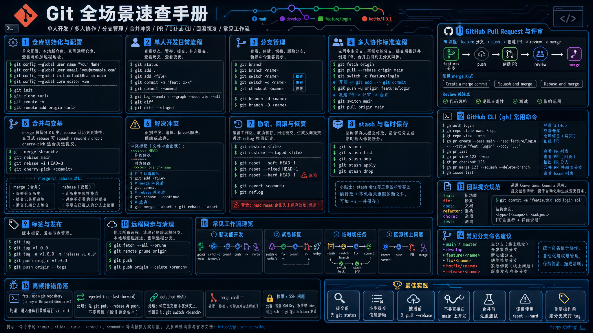
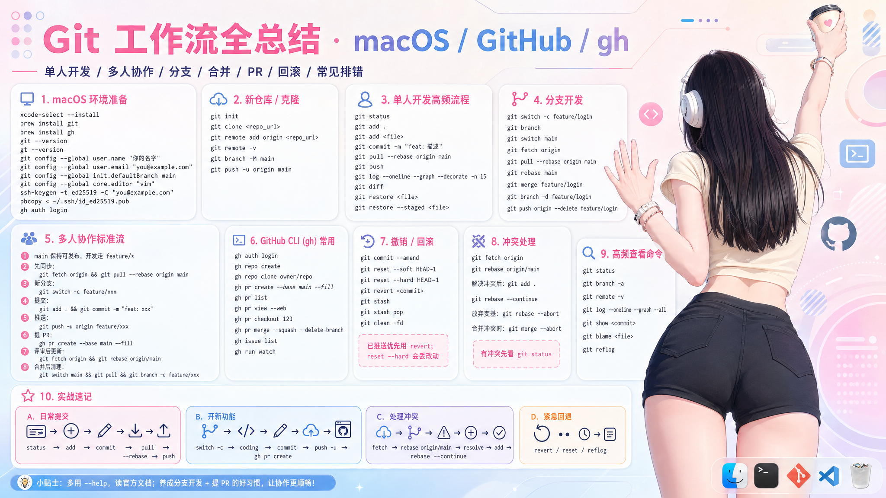

<div align="center">

# 📖 Git 从零到精通

**面向小白的 Git 最全使用教程**

从安装到协作，图文并茂，一看就懂

[](https://github.com/XiaoHuZi-design)
[](LICENSE)

</div>

---

## 📋 目录

- [一、Git 是什么？为什么要学？](#一git-是什么为什么要学)
- [二、安装与初始配置](#二安装与初始配置)
- [三、核心概念：三个区域](#三核心概念三个区域)
- [四、基础操作](#四基础操作)
- [五、分支管理](#五分支管理)
- [六、远程仓库](#六远程仓库)
- [七、撤销与回退](#七撤销与回退)
- [八、标签管理](#八标签管理)
- [九、协作工作流](#九协作工作流)
- [十、.gitignore 文件](#十gitignore-文件)
- [十一、常见问题与解决方案](#十一常见问题与解决方案)
- [十二、速查手册](#十二速查手册)

---

## 一、Git 是什么？为什么要学？

### 什么是 Git？

Git 是一个**分布式版本控制系统**。通俗地说：

> 它就像游戏的**存档系统** —— 你可以随时存档（提交），读档（回退），甚至创建平行世界（分支）来尝试不同玩法，互不影响。

### 为什么学 Git？

| 场景 | 没有 Git | 有 Git |
|------|----------|--------|
| 代码改崩了 | 找不到哪里改错了 | 一条命令回到任意历史版本 |
| 多人协作 | `最终版.docx` `最终版2.docx` `绝对最终版.docx` | 每人一个分支，自动合并 |
| 想尝试新功能 | 怕改坏不敢动 | 开个分支随便试，不行就删掉 |
| 面试 | — | 几乎所有公司都要求会 Git |

---

## 二、安装与初始配置

### 2.1 安装

**macOS（推荐 Homebrew）：**
```bash
brew install git
```

**Windows：**
下载 [Git for Windows](https://git-scm.com/download/win)，安装后会有 Git Bash 终端。

**Linux（Ubuntu/Debian）：**
```bash
sudo apt install git
```

**验证安装：**
```bash
git --version
# git version 2.x.x
```

### 2.2 必做配置

安装完后，**第一件事**就是告诉 Git 你是谁：

```bash
# 设置用户名和邮箱（会出现在每次提交记录中）
git config --global user.name "你的名字"
git config --global user.email "你的邮箱@example.com"

# 设置默认分支名为 main（推荐）
git config --global init.defaultBranch main

# 设置默认编辑器（可选）
git config --global core.editor "code --wait"   # VS Code
# git config --global core.editor vim             # Vim

# 查看所有配置
git config --list
```

> 💡 `--global` 表示全局配置，所有仓库生效。如果只想对单个仓库配置，去掉 `--global` 在仓库目录内执行。

### 2.3 配置 SSH Key（推荐）

这样 push 代码时不用每次输密码：

```bash
# 生成 SSH 密钥
ssh-keygen -t ed25519 -C "你的邮箱@example.com"
# 一路回车即可

# 查看公钥，复制到 GitHub → Settings → SSH Keys
cat ~/.ssh/id_ed25519.pub

# 测试连接
ssh -T git@github.com
# Hi username! You've successfully authenticated...
```

---

## 三、核心概念：三个区域

这是理解 Git 最关键的一张图：

```
┌─────────────┐    git add    ┌─────────────┐   git commit   ┌─────────────┐
│             │ ────────────▶ │             │ ─────────────▶ │             │
│   工作区     │               │   暂存区     │               │   本地仓库   │
│ (Working    │               │ (Staging    │               │ (Local      │
│  Directory) │ ◀──────────── │  Area)      │               │  Repository)│
│             │  git checkout │             │               │             │
└─────────────┘  (restore)    └─────────────┘               └──────┬──────┘
                                                                       │
                                                          git push    │ git pull
                                                          ──────────▶  │ ◀──────────
                                                                       │
                                                               ┌──────┴──────┐
                                                               │             │
                                                               │   远程仓库   │
                                                               │  (Remote    │
                                                               │  Repository)│
                                                               │             │
                                                               └─────────────┘
```

| 区域 | 英文名 | 通俗理解 | 你在这里做什么 |
|------|--------|----------|----------------|
| 工作区 | Working Directory | 你能看到的项目文件夹 | 写代码、改文件 |
| 暂存区 | Staging Area | 一个"购物车" | 挑选要提交的改动 |
| 本地仓库 | Local Repository | 本地的"存档" | 保存了一次完整快照 |
| 远程仓库 | Remote Repository | GitHub/GitLab 上的仓库 | 和别人共享代码 |

### 文件的四种状态

```
                    git add
  Untracked ──────────────▶ Staged
  (未追踪)                   (已暂存)

                    git add
  Modified  ──────────────▶ Staged
  (已修改)                   (已暂存)

                    git commit
  Staged    ──────────────▶ Committed
  (已暂存)                   (已提交)

                    编辑文件
  Committed ──────────────▶ Modified
  (已提交)                   (已修改)
```

---

## 四、基础操作

### 4.1 创建仓库

```bash
# 方式一：在现有目录初始化
cd my-project
git init

# 方式二：克隆远程仓库
git clone https://github.com/xxx/project.git
git clone git@github.com:xxx/project.git    # SSH 方式（推荐）
```

### 4.2 日常工作流（最重要！）

```bash
# 1️⃣ 查看当前状态（最常用的命令！）
git status

# 2️⃣ 把修改加入暂存区
git add hello.py                # 添加单个文件
git add hello.py world.py       # 添加多个文件
git add .                       # 添加所有修改（最常用）

# 3️⃣ 提交到本地仓库
git commit -m "feat: 添加用户登录功能"

# 4️⃣ 推送到远程仓库
git push
```

### 4.3 写好提交信息

**推荐格式（Conventional Commits）：**

```
<类型>: <简短描述>

[可选的详细说明]
```

| 类型 | 用途 | 示例 |
|------|------|------|
| `feat` | 新功能 | `feat: 添加用户注册功能` |
| `fix` | 修 bug | `fix: 修复登录失败的问题` |
| `docs` | 文档 | `docs: 更新 README` |
| `style` | 格式调整（不影响逻辑） | `style: 统一缩进为 2 空格` |
| `refactor` | 重构 | `refactor: 抽取公共组件` |
| `test` | 测试 | `test: 添加登录模块单元测试` |
| `chore` | 杂项 | `chore: 升级依赖版本` |

> 💡 **原则**：一个 commit 只做一件事，描述要让人一眼看懂"做了什么"。

### 4.4 查看历史

```bash
# 查看提交历史
git log

# 简洁版（推荐）
git log --oneline

# 图形化显示分支
git log --oneline --graph --all

# 查看某个文件的历史
git log --follow hello.py

# 查看某次提交的详细内容
git show abc1234
```

### 4.5 查看差异

```bash
# 查看工作区和暂存区的差异（还没 add 的改动）
git diff

# 查看暂存区和上次提交的差异（已经 add 但还没 commit 的改动）
git diff --staged

# 查看两次提交之间的差异
git diff abc1234 def5678

# 只看改了哪些文件（不看具体内容）
git diff --name-only
```

---

## 五、分支管理

### 5.1 什么是分支？

> 分支就像**平行宇宙** —— 你可以在新宇宙里随意实验，不会影响主宇宙。实验成功了再合并回来。

```
main:     A ── B ── C ──────────── F (merge)
                 \                /
feature:          D ── E ───────
```

### 5.2 分支基本操作

```bash
# 查看所有分支
git branch           # 本地分支
git branch -a        # 包括远程分支

# 创建分支
git branch feature-login        # 创建
git checkout feature-login      # 切换
# 或者一步到位（推荐）：
git checkout -b feature-login   # 创建并切换
# 更新的写法：
git switch -c feature-login     # 创建并切换（Git 2.23+）

# 切换回主分支
git checkout main
# 或
git switch main

# 删除分支
git branch -d feature-login     # 已合并的分支
git branch -D feature-login     # 强制删除（不管有没有合并）

# 重命名分支
git branch -m old-name new-name
```

### 5.3 合并分支

```bash
# 把 feature 分支合并到 main
git checkout main
git merge feature

# 如果有冲突，Git 会提示你：
# 1. 打开冲突文件，手动选择保留的内容
# 2. 然后 add + commit
git add .
git commit -m "merge: 合并 feature 分支"
```

**冲突长什么样：**

```python
# Git 会把冲突标记出来：
<<<<<<< HEAD
这是 main 分支的代码
=======
这是 feature 分支的代码
>>>>>>> feature
# 你需要选择保留哪一个（或合并两者），然后删掉标记
```

### 5.4 Rebase：让历史更整洁

```bash
# 在 feature 分支上执行 rebase
git checkout feature
git rebase main
```

```
# merge 的结果（会保留分叉）：
main:   A ── B ── C ──── F (merge commit)
               \        /
feature:        D ── E

# rebase 的结果（线性历史）：
main:   A ── B ── C ── D' ── E'
```

> ⚠️ **黄金法则**：**永远不要 rebase 已经 push 的公共分支**，只在自己的分支上用。

---

## 六、远程仓库

### 6.1 关联远程仓库

```bash
# 查看远程仓库
git remote -v

# 添加远程仓库
git remote add origin https://github.com/xxx/project.git
git remote add origin git@github.com:xxx/project.git   # SSH

# 修改远程仓库地址
git remote set-url origin git@github.com:xxx/new-project.git

# 删除远程仓库关联
git remote remove origin
```

### 6.2 推送与拉取

```bash
# 首次推送（设置上游分支）
git push -u origin main
# 之后直接
git push

# 推送所有分支
git push --all

# 拉取远程更新（推荐）
git pull                    # = git fetch + git merge
git pull --rebase           # = git fetch + git rebase（推荐，保持线性历史）

# 仅下载不合并
git fetch origin
git fetch --all
```

### 6.3 在 GitHub 上创建新仓库并推送

```bash
# 方式一：命令行创建
gh repo create my-project --public
git push -u origin main

# 方式二：从头开始
mkdir my-project && cd my-project
git init
echo "# My Project" > README.md
git add .
git commit -m "init: 初始化项目"
git remote add origin git@github.com:xxx/my-project.git
git push -u origin main
```

---

## 七、撤销与回退

> 这是新手最容易紧张的部分，但其实 Git 几乎可以撤销一切。

### 7.1 撤销工作区的修改（还没 add）

```bash
# 撤销单个文件的修改
git checkout -- hello.py
# 或（新写法，推荐）
git restore hello.py

# 撤销所有修改（危险！会丢失所有未暂存的改动）
git restore .
```

### 7.2 撤销暂存（add 了但还没 commit）

```bash
# 把文件从暂存区移回工作区（不会丢失修改）
git reset HEAD hello.py
# 或（新写法，推荐）
git restore --staged hello.py

# 移除所有暂存
git restore --staged .
```

### 7.3 撤销提交（commit 了但还没 push）

```bash
# 修改最近一次提交（比如改提交信息或漏了文件）
git commit --amend -m "新的提交信息"
git commit --amend --no-edit   # 不改信息，只追加文件

# 回退到上一个版本（保留修改在工作区）
git reset HEAD~1
# 或
git reset --mixed HEAD~1

# 回退到上一个版本（保留修改在暂存区）
git reset --soft HEAD~1

# 回退到上一个版本（彻底删除修改，危险！）
git reset --hard HEAD~1

# 回退到指定版本
git reset --hard abc1234
```

**reset 三种模式对比：**

| 模式 | 工作区 | 暂存区 | 说明 |
|------|--------|--------|------|
| `--soft` | 保留 | 保留 | 只移动 HEAD 指针 |
| `--mixed`（默认） | 保留 | 清空 | 撤销 add + commit |
| `--hard` | 清空 | 清空 | 彻底回退，慎用！ |

### 7.4 撤销已推送的提交（已经 push 了）

```bash
# 创建一个新提交来"反做"之前的提交（安全，推荐）
git revert abc1234
git push
```

> 💡 **已 push 的代码用 revert，未 push 的用 reset。**

### 7.5 Stash：临时保存工作

```bash
# 临时保存当前工作（比如要切分支修 bug）
git stash
git stash save "临时保存的说明"

# 查看保存列表
git stash list

# 恢复最近一次保存
git stash pop          # 恢复并删除
git stash apply        # 恢复但不删除

# 恢复指定的保存
git stash apply stash@{2}

# 删除保存
git stash drop stash@{0}
git stash clear        # 清空所有
```

### 7.6 找回丢失的提交

```bash
# 查看所有操作记录（即使已经 reset 了）
git reflog

# 找到想恢复的提交号，然后
git reset --hard abc1234
```

> 💡 `reflog` 是终极后悔药，几乎可以找回一切！

---

## 八、标签管理

```bash
# 创建标签
git tag v1.0.0                          # 轻量标签
git tag -a v1.0.0 -m "正式版 1.0.0"     # 附注标签（推荐）

# 查看标签
git tag
git tag -l "v1.*"          # 按模式搜索
git show v1.0.0            # 查看标签详情

# 给历史提交打标签
git tag -a v0.9.0 abc1234 -m "0.9.0 版本"

# 推送标签到远程
git push origin v1.0.0     # 推送单个
git push origin --tags      # 推送所有

# 删除标签
git tag -d v1.0.0                   # 本地删除
git push origin :refs/tags/v1.0.0   # 远程删除
```

**语义化版本号（SemVer）：**

```
v 主版本号.次版本号.修订号
  │      │      └── 修 bug（向后兼容）
  │      └── 新功能（向后兼容）
  └── 不兼容的大改动
```

---

## 九、协作工作流

### 9.1 Fork + PR 工作流（开源项目常用）

```
1. Fork 别人的仓库到自己账号下
2. Clone 自己的 Fork
3. 创建功能分支
4. 开发 + 提交
5. Push 到自己的 Fork
6. 向原仓库发起 Pull Request
7. 等待审核 + 合并
```

```bash
# 克隆自己 fork 的仓库
git clone git@github.com:你的ID/project.git
cd project

# 添加原仓库为上游（方便同步更新）
git remote add upstream git@github.com:原作者ID/project.git

# 同步原仓库的最新代码
git fetch upstream
git checkout main
git merge upstream/main

# 创建功能分支开发
git checkout -b feature/my-feature
# ... 写代码 ...
git add .
git commit -m "feat: 添加新功能"
git push -u origin feature/my-feature
# 然后去 GitHub 页面点 "New Pull Request"
```

### 9.2 团队内部协作

```bash
# 每天开始工作前
git checkout main
git pull --rebase

# 创建功能分支
git checkout -b feature/xxx

# 开发过程中定期提交
git add .
git commit -m "feat: 完成xxx"

# 完成后合并到主分支
git checkout main
git pull --rebase
git merge feature/xxx
# 或 git rebase feature/xxx
git push
```

### 9.3 解决合并冲突

```bash
# 拉取时冲突
git pull
# 提示 CONFLICT，手动解决后：
git add .
git commit -m "merge: 解决冲突"

# 或用工具查看冲突
git mergetool

# 查看冲突文件列表
git diff --name-only --diff-filter=U
```

---

## 十、.gitignore 文件

在项目根目录创建 `.gitignore`，告诉 Git 忽略哪些文件：

```gitignore
# 编译产物
*.o
*.class
*.exe
build/
dist/

# 依赖目录
node_modules/
venv/
__pycache__/

# IDE 配置
.vscode/
.idea/
*.swp

# 系统文件
.DS_Store
Thumbs.db

# 环境变量（重要！防止泄露密钥）
.env
.env.local

# 日志文件
*.log
```

> 💡 已被 Git 追踪的文件，加入 `.gitignore` 后还需要执行：
> ```bash
> git rm --cached 文件名    # 从追踪中移除（不删文件）
> git commit -m "chore: 更新 .gitignore"
> ```

---

## 十一、常见问题与解决方案

### Q1: `git push` 被拒绝？

```bash
# 远程有更新，先拉取再推送
git pull --rebase
git push

# 如果还是不行（确保你知道自己在做什么！）
git push --force-with-lease    # 安全的强制推送
```

### Q2: commit 信息写错了？

```bash
# 只改最近一次
git commit --amend -m "正确的提交信息"

# 已经 push 了就不要用 amend！用：
# （没办法改了，下次注意）
```

### Q3: 提交错文件了？

```bash
# 撤销最近一次提交，文件回到暂存区
git reset --soft HEAD~1

# 从暂存区移除不需要的文件
git restore --staged 不该提交的文件

# 重新提交
git commit -m "正确的提交信息"
```

### Q4: 想删除已经 push 的文件（比如密钥）？

```bash
# 从仓库移除但保留本地文件
git rm --cached 敏感文件
echo "敏感文件" >> .gitignore
git add .
git commit -m "chore: 移除敏感文件"
git push
```

> ⚠️ 如果密钥已经泄露，**立即更换密钥**！Git 历史中仍可看到。

### Q5: merge 冲突太多，想放弃？

```bash
# 放弃正在进行的 merge
git merge --abort

# 放弃正在进行的 rebase
git rebase --abort
```

### Q6: 不小心 `reset --hard` 了，代码没了？

```bash
# 终极后悔药
git reflog
# 找到丢失的提交号，如 abc1234
git reset --hard abc1234
```

### Q7: 怎么查看某个文件的某一行是谁写的？

```bash
git blame 文件名
# 或查看指定行范围
git blame -L 10,20 文件名
```

---

## 十二、速查手册

### 命令速查表

| 场景 | 命令 |
|------|------|
| 初始化 | `git init` |
| 克隆 | `git clone <url>` |
| 查看状态 | `git status` |
| 添加到暂存区 | `git add .` |
| 提交 | `git commit -m "信息"` |
| 推送 | `git push` |
| 拉取 | `git pull` |
| 查看日志 | `git log --oneline` |
| 创建分支 | `git switch -c <分支名>` |
| 切换分支 | `git switch <分支名>` |
| 合并分支 | `git merge <分支名>` |
| 暂存工作 | `git stash` |
| 恢复暂存 | `git stash pop` |
| 撤销工作区修改 | `git restore <文件>` |
| 撤销暂存 | `git restore --staged <文件>` |
| 回退提交 | `git reset --soft HEAD~1` |
| 反做提交 | `git revert <提交号>` |
| 查看差异 | `git diff` |
| 查看操作记录 | `git reflog` |
| 创建标签 | `git tag -a v1.0 -m "说明"` |

### Git 全场景速查手册



### Git 工作流全总结



---

## 🔗 推荐资源

- [Pro Git 官方电子书](https://git-scm.com/book/zh/v2)（免费，中文）
- [GitHub 官方教程](https://docs.github.com/zh)
- [Learn Git Branching](https://learngitbranching.js.org/)（交互式学习，强烈推荐）
- [Oh Shit, Git!?!](https://ohshitgit.com/zh)（常见问题的简单解决方案）

---

<div align="center">

**如果这个教程对你有帮助，欢迎 ⭐ Star 支持！**

</div>
